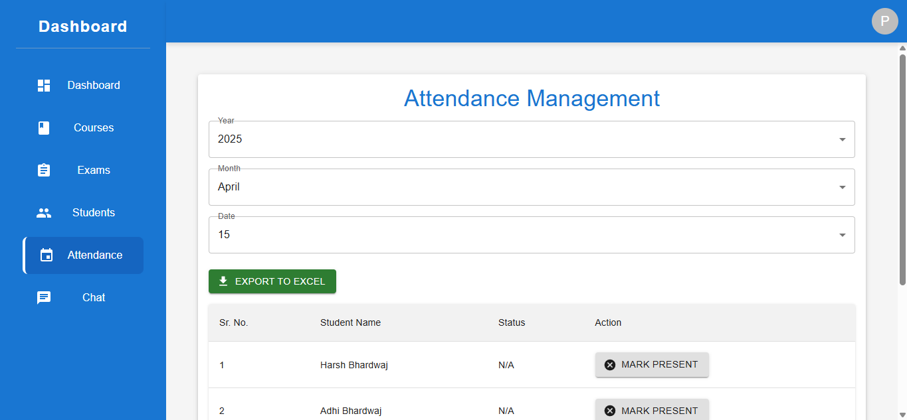

Here’s a more **attractive, professional, and developer-friendly** version of your `README.md` with improved formatting, better visual flow, consistent icon usage, and a cleaner **📸 Screenshots** section. I've removed duplicate screenshots and made headers visually distinct and minimalistic, keeping it stylish and easy to navigate:

---

```markdown
# 🎓 School Management & Communication System

An all-in-one digital platform designed to streamline communication, attendance tracking, and academic management for schools. Built with modern web technologies, it offers real-time features and a Progressive Web App (PWA) experience.

---

## 🚀 Overview

This platform empowers students, teachers, and administrators with:

- 🔹 Real-time chat for seamless communication  
- 🔹 Smart, location-aware attendance system  
- 🔹 Secure document sharing (images, videos, PDFs)  
- 🔹 Academic tools: syllabus, timetables, results  
- 🔹 PWA capabilities for native-like performance  
- 🔹 Clean, intuitive dashboard and navigation

---

## ✨ Features

### 💬 Real-Time Communication
- One-on-one or group messaging using Socket.IO

### 📍 Smart Attendance System
- Teachers mark attendance for the entire class
- Students mark attendance only within class hours and 50m GPS radius

### 📂 File & Media Sharing
- Upload images, videos, and PDFs for classes and exams

### 📖 Academic Management
- Manage students, courses, exam schedules, and results

### 📱 PWA Support
- Installable app experience on any device

### 🧭 Intuitive UI Navigation
- Dashboard, Courses, Exams, Students, Attendance, Chat, and more

---

## 🛠 Tech Stack

| Frontend         | Backend             | Features              |
|------------------|---------------------|------------------------|
| React + Vite     | Firebase (Auth, DB) | Socket.IO (chat)       |
| Material UI      | Cloudinary (uploads)| Axios (HTTP)          |
| SweetAlert2      | Realtime DB         | XLSX (exports)        |
| React PDF Viewer |                     | Vite PWA Plugin       |

---

## 🔧 Installation

```bash
# 1. Clone the repository
git clone https://github.com/your-repository-url.git
cd your-project-folder

# 2. Install dependencies
npm install

# 3. Run development server
npm run dev

# 4. Build for production
npm run build

# 5. Deploy
npm run deploy
```

---

## 🎯 Usage Guide

- 🔐 **Login / Signup**: Secure role-based access
- 🗂 **Manage Students & Courses**: Add, edit, and view student data
- 📍 **Attendance**: Teachers mark and monitor attendance; students mark using geolocation
- 📂 **Document Sharing**: Upload study materials, PDFs, and results
- 💬 **Chat System**: Real-time communication for quick updates
- 📱 **PWA Install**: Add to home screen on mobile devices

---

## 📸 Screenshots

### 🔷 Dashboard & Navigation

#### 📊 Dashboard Overview


#### 📚 Courses


#### 📝 Exams


#### 🎓 Students


#### 📅 Attendance


#### 💬 Chat


---

### 🧑‍💼 Admin Panel Views

#### 🧑‍🏫 Students Admin


#### 🗓️ Attendance Admin


---

### 🧭 Navbar & Profile

#### 👤 View Profile


---

### 🔐 Authentication

#### 🔓 Login


#### 📝 Signup


---

## 📜 License

Licensed under the [MIT License](LICENSE).

---

## 👥 Contributor

- **Harsh Sharma** – Full Stack Developer  
  🌐 [Portfolio](https://your-portfolio.com) | ✉️ harsh@example.com

---
```

---

### ✅ Optional Upgrades You Can Ask For:
- Add collapsible sections using HTML (`<details>`)
- Include **dark mode screenshots**
- Add **live demo** or **deployment badges**
- Include a **GitHub Stats card** (for your profile)

Would you like me to prepare those upgrades too?
