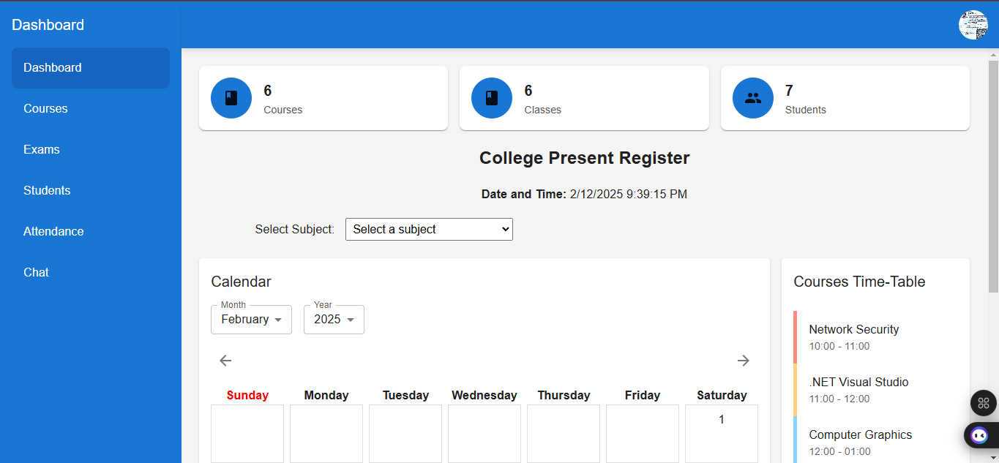
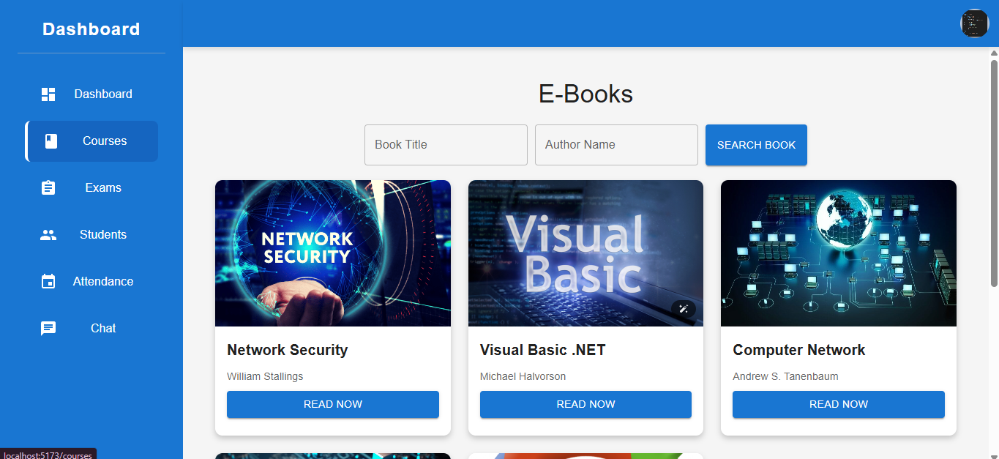
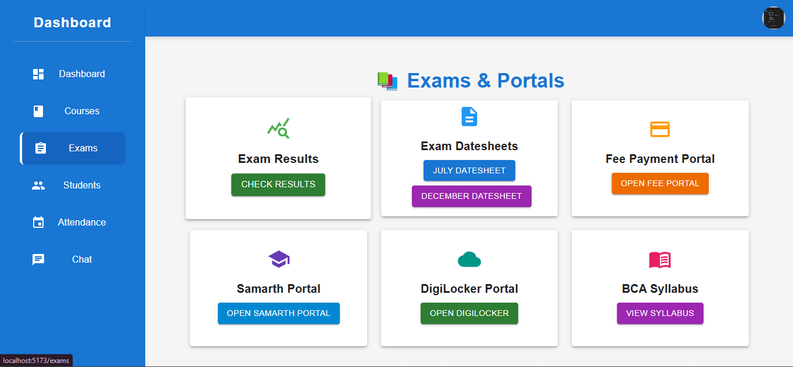
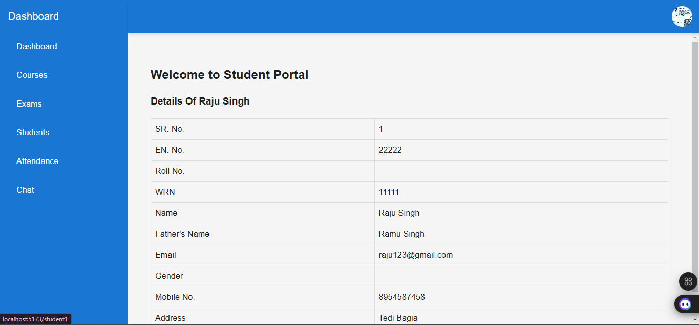
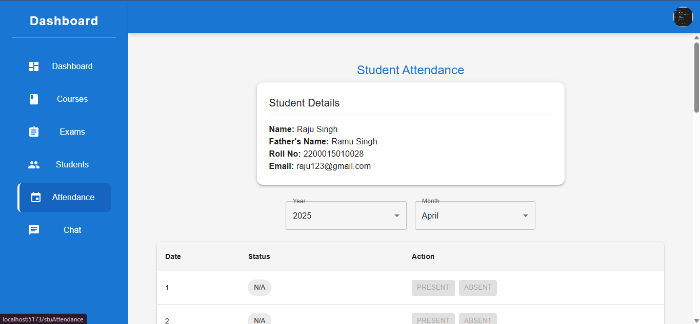
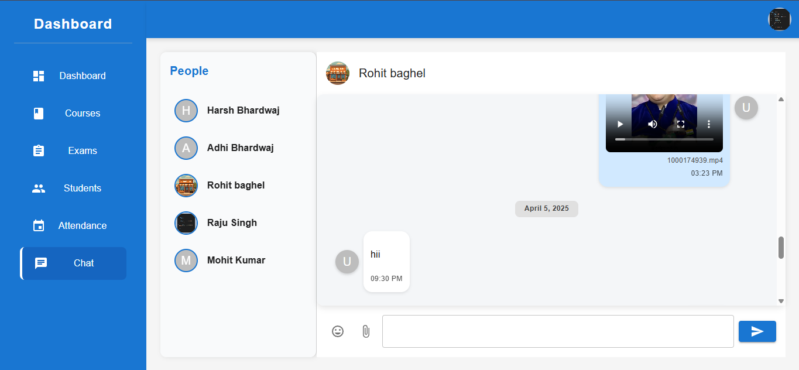
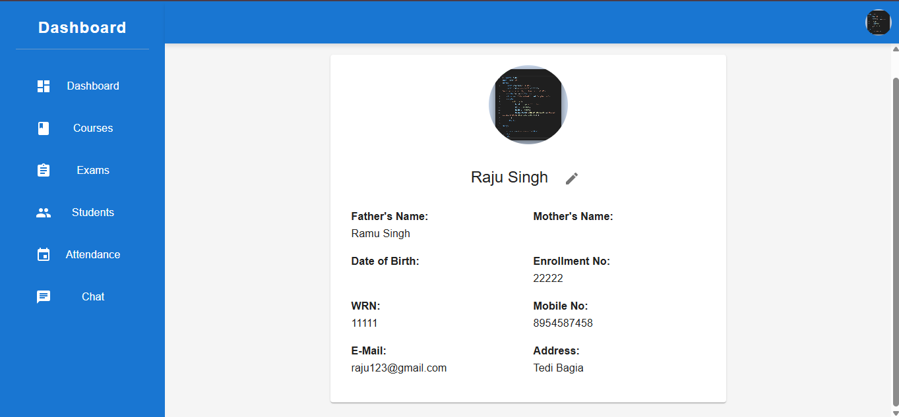
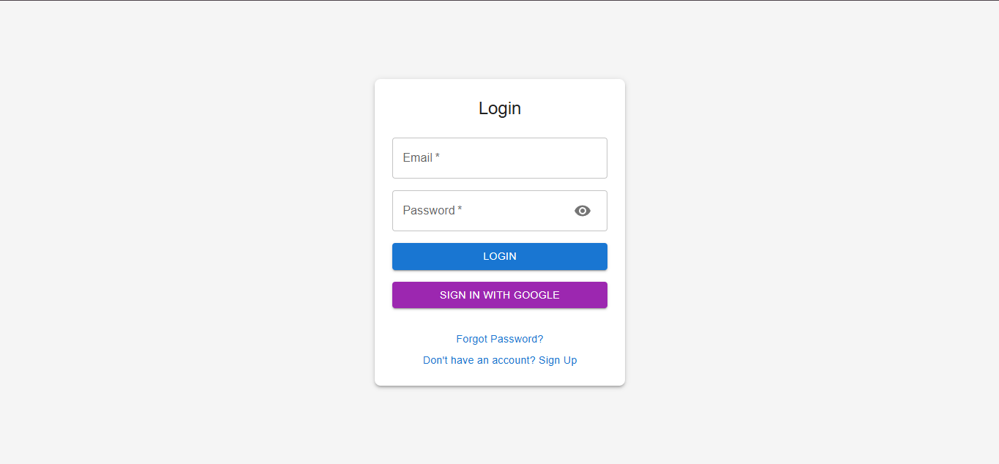

# 🎓 School Management & Communication System

## 🚀 Overview

This all-in-one digital platform empowers students and teachers with seamless communication, smart attendance tracking, and effortless document sharing. Designed for a modern learning experience, it integrates real-time chat, academic management, and PWA support for accessibility across devices.

## ✨ Key Features

- **💬 Real-Time Chat**: Instant student-teacher messaging for improved collaboration.
- **📊 Smart Attendance System**:
  - Teachers can mark attendance for all students.
  - Students can only mark attendance during class hours and within a 50m radius of the classroom.
- **📂 Document Sharing**: Effortlessly share images, videos, PDFs, and essential study materials.
- **📖 Academic Tools**:
  - Share syllabus, timetables, exam schedules, and results.
  - Access student profiles with detailed information.
- **📱 Progressive Web App (PWA)**: Install and use the app like a native mobile application.
- **🗂 Intuitive Navigation**:
  - 📌 Dashboard
  - 📚 Courses
  - 📝 Exams
  - 🎓 Students
  - 📅 Attendance
  - 💬 Chat
- **👤 Profile Options**:
  - 🔍 View Profile
  - ⚙️ Settings
  - 🚪 Logout

## 🛠 Technologies Used

- **🌐 Frontend**: React, Vite, Material UI, SweetAlert2
- **🔥 Backend**: Firebase, Cloudinary, Socket.IO
- **⚡ Real-time Communication**: Socket.IO
- **☁️ File Management**: Cloudinary, Axios
- **📜 PDF Viewing**: React PDF Viewer
- **📊 Data Handling**: XLSX
- **🔗 PWA Support**: Vite PWA Plugin

## 🔧 Installation

1. Clone the repository:
   ```bash
   git clone https://github.com/your-repository-url.git
   cd your-project-folder
   ```
2. Install dependencies:
   ```bash
   npm install
   ```
3. Start the development server:
   ```bash
   npm run dev
   ```
4. Build for production:
   ```bash
   npm run build
   ```
5. Deploy the project:
   ```bash
   npm run deploy
   ```

## 🎯 How to Use

- **🔑 Login**: Secure authentication for students and teachers.
- **💬 Chat**: Communicate instantly via real-time messaging.
- **📍 Attendance**: Smart location-based student attendance marking.
- **📂 File Sharing**: Teachers upload and distribute essential documents.
- **📱 PWA Installation**: Install the app for a seamless mobile-friendly experience.

## 📸 Screenshots

### 📌 Sidebar Screenshots







### 🔍 Navbar Screenshots



### 🔑 Authentication Screenshots



(Add your screenshots in the `screenshots` folder and update the paths accordingly.)

## 📜 License

This project is licensed under the MIT License.

## 👥 Contributors

- [Your Name] (Developer)

---

Let me know if you need further refinements! 🚀

